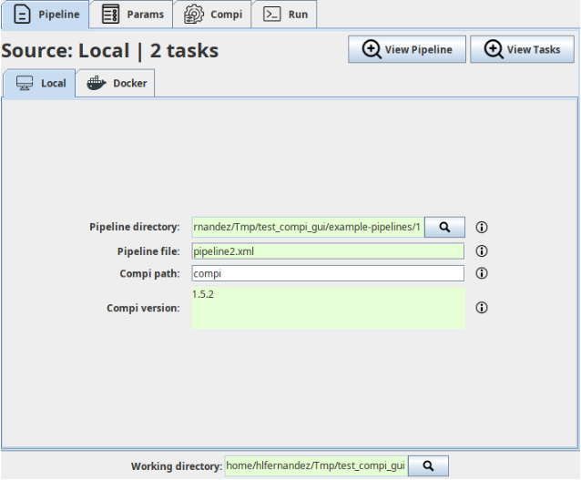

# Compi GUI [](https://github.com/sing-group/compi-gui) [](http://www.sing-group.org/compi) [](https://doi.org/10.7717/peerj-cs.593)

Compi GUI is a desktop application that provides a graphical interface for running [Compi](http://sing-group.org/compi) pipelines. It supports loading pipelines from a local XML file or from a Docker image, configuring pipeline parameters, selecting which tasks to run, and launching the execution — all without using the command line.



## Build from source

```
mvn clean package
```

The executable JAR will be available at `target/compi-gui-1.0.0.jar`.

To also produce a distributable package under `target/dist/`:

```
mvn clean package -PcreateDist
```

## Run

```
java -jar target/compi-gui-1.0.0.jar
```

## Usage

1. Select a **working directory** — Compi GUI will load pipeline configuration and parameter values from this directory if they exist.
2. Choose the pipeline source: a **local pipeline XML file** (with an optional local `compi` binary) or a **Docker image** containing the pipeline.
3. Configure **parameter values** in the parameters panel. Invalid or missing required values are highlighted.
4. Optionally select specific **tasks** to run (from task, until task, after task, before task).
5. Click **Run** to execute the pipeline. Output and error logs are shown in real time.

## Citing

Please, cite the following publication if you use Compi:
- H. López-Fernández; O. Graña-Castro; A. Nogueira-Rodríguez; M. Reboiro-Jato; D. Glez-Peña (2021) **Compi: a Framework for Portable and Reproducible Pipelines**. *PeerJ Computer Science*. Volume 7: e593. ISSN: 2376-5992 [](https://doi.org/10.7717/peerj-cs.593)
